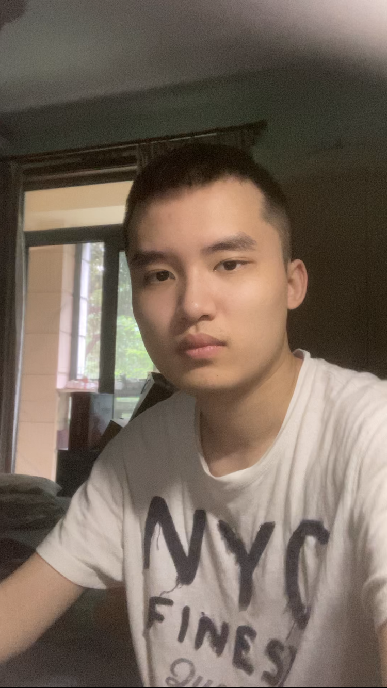

# Yinlong Mi
**CSE 110 student user page**

[Go to first assignment](#first-assignment)
### My Profile:
Picture of myself:

- Daily
  - likes cooking
  - studying at UCSD
  - enjoy programming
  - play online games otherwise
- Academically
  - Major in Mathematics-Computer Science
  - Minor in Data Science
  - Senior year
  - GPA 3.8

CSE Upper Course lists:
- [x] CSE 100
- [x] CSE 105
- [ ] CSE 110
- [ ] CSE 151A

### First assignment:
> Lab Week 0 & 1 - VSCode, Markdown, and Git Part 1
Use `git branch add-read-me` to create the branch for first assignment.
Edited my first [README.md](README.md)
Read this [documentation](https://code.visualstudio.com/docs/sourcecontrol/overview#_git-support) for using git within VS Code.

[Go back to top](#yinlong-mi)